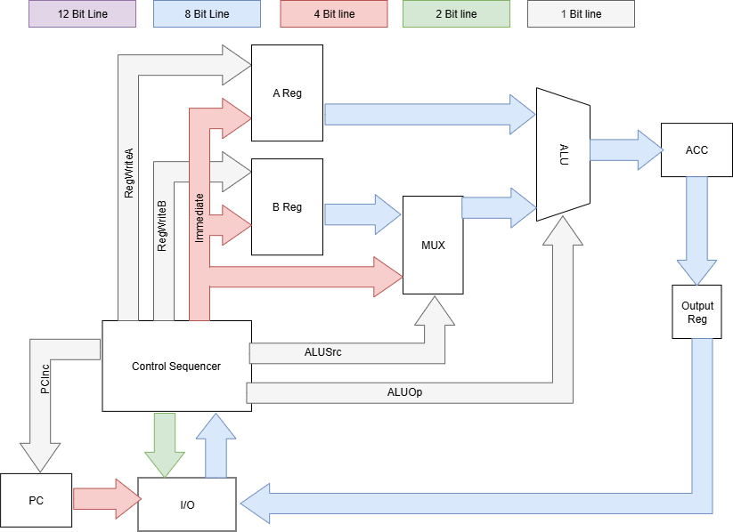

<!---

This file is used to generate your project datasheet. Please fill in the information below and delete any unused
sections.

You can also include images in this folder and reference them in the markdown. Each image must be less than
512 kb in size, and the combined size of all images must be less than 1 MB.
-->

## How it works
Our goal for this project is to implement 8-bit CPU using the TinyTapout. Below, you will find the proposal diagram that we plan to work on over the term, based off time and complexity restraints we will focus on adding more features to our cpu as needed:

## Table of I/O Assignments

Considering the limited amount of input and outputs on the chip, we had to be smart with how we map the signals to each pin. Below, you will find our mapping:

| Internal Mapping | Pin Mapping | I/O |
| ---------------- | ----------- | --- |
| Data Bus Out [7:0] | Out [7:0] | Out - Output of CPU |
| Data Bus In [7:0] | In [7:0] | In - Take in instruction from test script |
| PC | I/O [7:4] | Out - Send to test script for correct instruction |
| Instruction Enable | I/O [3] | Out - Tells test script to send instruction |
| Status | I/O [2] | Out - Tells status of CPU (active, error) |
| Clk | I/O [1] | In - clock for CPU controlled by test script |
| RST' | I/O [0] | In - Resets PC |

## Architecture
The processor's operation is coordinated by several key functional blocks:

Control Seq: This is the brains of the CPU. It's a stae machine that takes in instructions from the I/O, interprets its opcode and what to do with it's immediate value.

Arithmetic Logic Unit (ALU):

Registers:
Index (A and B): Two 8-bit registers used for tempory storage.
Accumulator (Acc): An 8-bit register where the output of the ALU is saved.
Output: An 8-bit register used to hold the value of the output while CPU works on next instruction.
