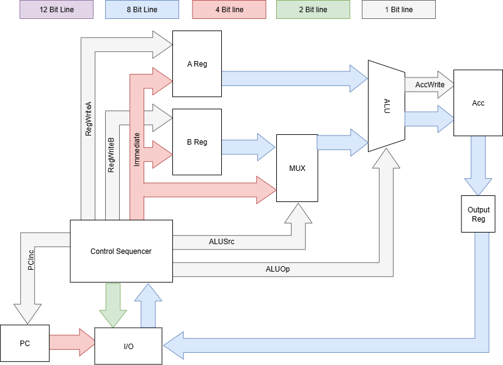

<!---

This file is used to generate your project datasheet. Please fill in the information below and delete any unused
sections.

You can also include images in this folder and reference them in the markdown. Each image must be less than
512 kb in size, and the combined size of all images must be less than 1 MB.
-->

## How it works

Table of I/O Assignments

| Internal Mapping | Pin Mapping | I/O |
| ---------------- | ----------- | --- |
| Data Bus Out [7:0] | Out [7:0] | Out - Output of CPU |
| Data Bus In [7:0] | In [7:0] | In - Take in instruction from test script |
| PC | I/O [7:4] | Out - Send to test script for correct instruction |
| Instruction Enable | I/O [3] | Out - Tells test script to send instruction |
| Status | I/O [2] | Out - Tells status of CPU (active, error) |
| Clk | I/O [1] | In - clock for CPU controlled by test script |
| RST' | I/O [0] | In - Resets PC |
## How to test

## External hardware

List external hardware used in your project (e.g. PMOD, LED display, etc), if any
